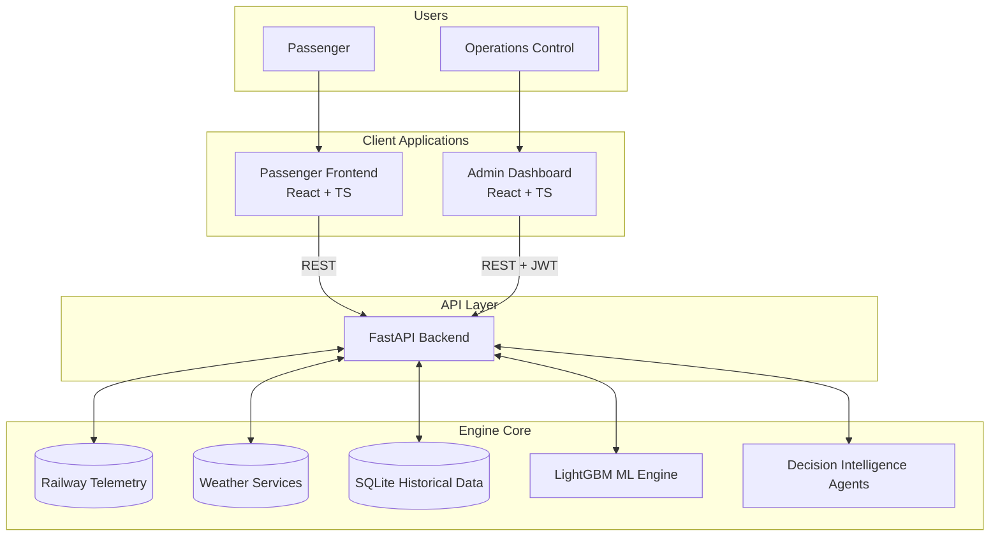
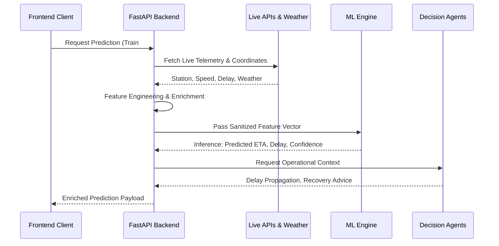

<div align="center">
  <h1>🚆 NexRail AI</h1>
  <h3>AI-Powered Dynamic ETA & Railway Decision Intelligence</h3>

  <p>
    <strong>Predict. Understand. Act.</strong><br>
    <em>Smart India Hackathon 2026 | Problem Statement: SIH26028 | Ministry of Railways</em>
  </p>

  <p>
    
    
    
    
    
    
    
  </p>
</div>

---

**NexRail AI** bridges the gap between static railway timetables and dynamic real-world operations. By combining real-time railway telemetry, machine learning, weather-aware intelligence, and actionable decision agents, NexRail predicts *when* a train will arrive and advises controllers on *how* to actively manage the network.

---

## 🛑 Why NexRail AI?

Traditional timetable-based Expected Time of Arrival (ETA) systems fall short in dense, high-capacity railway networks. Real-world train operations are highly sensitive to dynamic factors:
- **Current cascading delays**
- **Congestion and speed restrictions**
- **Late incoming rake turnovers**
- **Route topology and signal aspects**
- **Atmospheric/Weather interference** (e.g., dense fog, monsoon rains)

NexRail AI intelligently incorporates these variables. It doesn't just calculate speed and distance—it leverages historical punctuality profiles and live telemetry to generate a highly calibrated, confidence-scored ETA prediction.

---

## ✨ Core Features

| Feature | Description |
| :--- | :--- |
| **🚆 Dynamic ETA Prediction** | Robust **LightGBM** inference pipeline generating calibrated arrival predictions and projected destination delays. |
| **📡 Live Train Tracking** | Consumes real-time operational telemetry (speed, current station, block occupancy) to track fleet status. |
| **🌦️ Weather-Aware Intelligence** | Fuses historical weather constraints during model training, and enriches live predictions using current meteorological telemetry. |
| **🗺️ Live Train Map** | Visual topographical map enabling geospatial tracking of train coordinates and route progress. |
| **🔥 Delay Propagation** | Projects cascading delays across upcoming route stations to predict downstream operational impacts. |
| **🛠️ Recovery Advisor** | Formulates actionable dispatch interventions (e.g., speed recovery, dwell compression) based on available intelligence. |
| **🔄 Alternative Planning** | Identifies faster passenger alternatives traversing similar routes when severe delays occur. |
| **🧪 What-If Simulation** | Sandboxed environment to simulate operational disruptions (weather, track blocks) and evaluate predicted ETA impact. |
| **🧠 Explainability** | Exposes **SHAP (SHapley Additive exPlanations)** feature attribution to quantify the marginal impact of variables on the ETA. |
| **📊 Analytics & History** | Persists a historical log of predictions and network punctuality analytics for post-hoc verification. |
| **🔐 Role-Based Access** | Segregated Passenger and Control Center (Admin) interfaces secured by JWT bearer authentication. |

---

## 🏗️ Architecture



---

## 🌊 System Data Flow



---

## 🧠 Machine Learning

NexRail AI utilizes a highly optimized **LightGBM** gradient-boosted decision tree architecture. 

**Model Input Features:**
- **Train Characteristics:** Priority tier, locomotive type, rake length.
- **Route Metrics:** Distance, sectional geography, planned route.
- **Schedule Integrity:** Scheduled vs. actual departure, current delay, historical punctuality metrics.
- **Operational Status:** Current speed, maximum permitted speed, block occupancy constraints.
- **Temporal & Weather:** Seasonal severity, active meteorological conditions (fog, rain).

**Inference Flow:** The FastAPI backend securely loads the serialized `.pkl` pipeline into memory at startup. During a request, live data is synthesized into the required feature schema, strictly validated, and passed to the model for sub-second deterministic inference.

---

## 🌦️ Weather-Aware Intelligence

NexRail treats weather as a primary operational variable rather than an afterthought:

1. **Training Context:** The ML model is pre-trained on historical railway data seamlessly matched with historical atmospheric records (identifying patterns like visibility degradation during winter fog).
2. **Live Context:** During inference, the system queries live weather services using the train's dynamic geospatial coordinates. This context provides operators with visibility and precipitation warnings alongside the raw ETA prediction.

---

## 🤖 Decision Intelligence

NexRail goes beyond "What is the ETA?" to answer **"What happens next, and what can we do about it?"**

- **Delay Propagation Agent:** Projects the estimated delay at each upcoming station on the route.
- **Recovery Advisor:** Analyzes the delay severity and recommends operational actions (e.g., *"Enforce commercial dwell compression"* or *"Authorize sectional speed recovery"*).
- **Alternative Planning Agent:** Scans for other active services that may reach the destination sooner for stranded passengers.
- **What-If Simulation:** Allows controllers to manually inject constraints (e.g., unexpected track maintenance, sudden storms) to forecast the cascading impact.

---

## 👥 User Experiences

### 📲 Passenger Experience
A clean, frictionless portal designed for immediate insights.
- **Flow:** Search Train ➔ View Live Location ➔ Inspect Predicted ETA ➔ Check Weather Context ➔ View Station-by-Station Delay Propagation.

### 🎛️ Operations / Admin Experience
A high-density control center dashboard for dispatchers.
- **Flow:** Authenticate ➔ Monitor Fleet KPI Dashboard ➔ Track Active Prediction Streams ➔ Run What-If Scenarios ➔ Analyze Post-Hoc Prediction History.

---

## 🛠️ Tech Stack

| Layer | Technology | Purpose |
| :--- | :--- | :--- |
| **Backend** | Python 3.10, FastAPI | High-performance async REST API |
| **Machine Learning** | LightGBM, scikit-learn, SHAP | ETA inference and explainable AI |
| **Admin Frontend** | React 19, TypeScript, Vite | Operational dashboard & telemetry |
| **Passenger Frontend**| React 19, TypeScript, Vite | Public-facing passenger portal |
| **Database** | SQLite, SQLAlchemy | Persistence for analytics and history |
| **Authentication** | JWT, `pwdlib` | Stateless Role-Based Access Control |
| **Visualization** | Recharts, Leaflet | SHAP charts and geospatial mapping |

---

## 📂 Project Structure

```text
NexRail-AI/
├── backend/               # FastAPI core, API routes, DB models, DI Agents
├── frontend/              # Admin/Operations Control Center (React)
├── passenger-frontend/    # Public Passenger Application (React)
├── ml/                    # LightGBM training scripts, model artifacts, SHAP
├── data/                  # Historical data and feature datasets
├── data_pipeline/         # Scripts for raw data ingestion and enrichment
└── README.md              # You are here
```

---

## 🚀 Quick Start

### Prerequisites
- **Python 3.10+**
- **Node.js 20+**
- **npm**

### 1. Backend Setup
```bash
cd backend
python -m venv .venv
source .venv/bin/activate  # Or .venv\Scripts\activate on Windows
pip install -r requirements.txt

# Start the API
uvicorn app.main:app --reload --host 0.0.0.0 --port 8000
```

### 2. Admin Frontend Setup
```bash
cd frontend
npm install
npm run dev
```

### 3. Passenger Frontend Setup
```bash
cd passenger-frontend
npm install
npm run dev
```

---

## ⚙️ Environment Variables

Configure the following safely in a `.env` file within the `backend/` directory:

| Variable | Purpose | Required |
| :--- | :--- | :--- |
| `DATABASE_URL` | SQLite connection string (e.g., `sqlite:///./railwise.db`) | Yes |
| `SECRET_KEY` | Cryptographic key for JWT signature | Yes |
| `ALGORITHM` | JWT hashing algorithm (e.g., `HS256`) | Yes |
| `ACCESS_TOKEN_EXPIRE_MINUTES` | Token validity duration | Yes |

*Note: Never commit actual cryptographic secrets or external API keys to version control.*

---

## 🎯 SIH Jury Demo Flow

**1. Operations Control Demo (Admin)**
1. Log into the Central Operations Dashboard.
2. Review the prioritized Fleet KPIs and active predictive streams.
3. Search a specific train to launch the Live Telemetry view.
4. Inspect the **LightGBM Predicted Destination Delay** alongside SHAP Explainability factors.
5. Review the AI Dispatch Advisory for recovery suggestions.
6. Launch the **What-If Simulator** and inject a 30-minute track block to observe the dynamically updated ETA.

**2. Passenger Experience Demo**
1. Open the Passenger landing page.
2. Search for an active train number.
3. Observe the visually clean, intuitive Live Status layout.
4. Check the **Delay Propagation** timeline to see when the train will reach specific upcoming stops.
5. Check the live Weather Context for the current sector.

---

## 📷 Screenshots

*(Placeholder for UI screenshots. High-fidelity visual captures of the Admin Dashboard, Passenger Telemetry, and What-If Simulator can be added here prior to final submission.)*

---

## ⚠️ Current Limitations

- **Live API Dependency:** Live tracking heavily relies on the availability and latency of upstream railway telemetry APIs. If upstream data is stale, predictions degrade gracefully.
- **Limited Explainability:** SHAP feature attribution is only displayed when successfully generated by the backend pipeline; it falls back to an "Unavailable" state otherwise to prevent fabricating data.
- **Geospatial Precision:** Station coordinates are statically mapped for demo purposes; real GPS locomotive polling is required for production accuracy.

---

## 🛤️ Roadmap

- [ ] **Passenger AI Chatbot:** Conversational assistant for natural language ETA and routing queries.
- [ ] **Automated Post-Journey Calibration:** Feedback loops that automatically log actual arrival times against predictions to continuously re-weight the model.
- [ ] **Expanded Network Topologies:** Scaling from corridor-specific models to broader pan-network graph predictions.

---

## 🏆 Team & Attribution

**Smart India Hackathon 2026**  
**Problem Statement:** SIH26028  
**Organization:** Ministry of Railways  

*Designed and engineered for the future of railway operations.*
